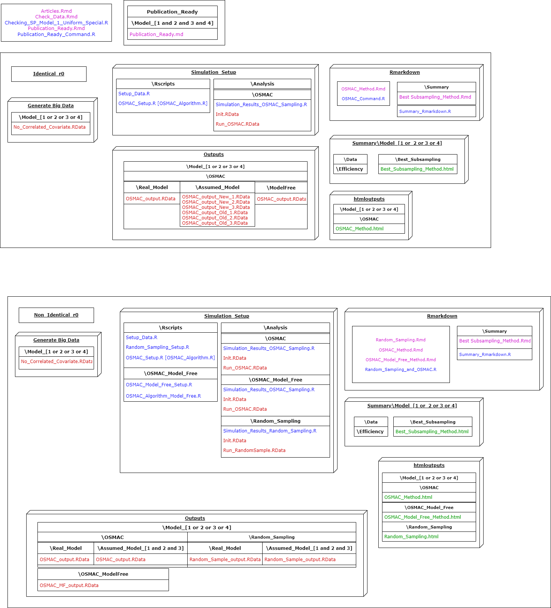
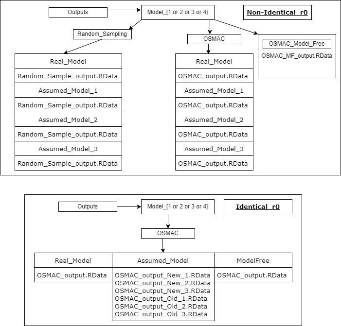

```{r setup, include=FALSE}
knitr::opts_chunk$set(echo = TRUE)
```

# 1. Overview

* The project ***"Uniform_Distribution"*** or ***"RS_OS_MROS_PR_TwoVar_Uniform"*** is developed for the purpose of conducting a simulation study such that estimated model parameters of the poisson regression model can be compared through the obtained informative samples from the Big Data using optimal sub-sampling and model robust optimal sub-sampling methods.

* This document aims to state every important part of this R project thoroughly in terms of folder structure related to used sub-sampling methods. 

# 2. Folder structure



* The sub-sampling methods applied in this study are 
1. Random Sampling, 
2. Optimal Sub-sampling (OSMAC), and
3. Model Robust Optimal Sub-sampling (OSMAC_MF or OSMAC Model Free).

* A detailed description of all methods are explained in the Figure below.


* Simulations are repeated ***Replicates*** times such that at each replicate only ***Subsample_Size*** data points are extracted from the Big Data set of ***N*** observations. It is necessary to have replications so that we can evaluate the methods through MSE and model information of the estimated model parameters.  

* The results from this simulation setup are stored in a such way that they could be summarised through Rmarkdown files for individual or grouped assessment for the above mentioned methods.

* In optimal sub-sampling and model robust optimal sub-sampling an initial sub-sample of **r0** observations are used to estimate the model parameters of a given model. From these parameters only the sub-sampling probabilities are calculated. Therefore, to compare optimal sub-sampling with model robust optimal sub-sampling there are two options; 1). Identical **r0** and 2). Non-Identical **r0**.

* Hence, **Identical_r0** can be used for method comparison and **Non_Identical_r0** can be used for application purposes.

## 2.1 Generated_Big_Data


* Generate and store Big Data.

* Based on the real model of the poisson regression data we have four folders and in each folder their respective Big Data sets are stored by using ***Checking_SP_Model_1_Uniform_Special.R***.

* To ensure that the data generated from the true model performs better than the assumed models run ***Check_Data.Rmd*** and look at the plots stored as **Model_[1 or 2 or 3 or 4]_X[1 or 2]**.

* In the Rscript, ***Replicates*** - number of unique simulations, ***Subsample_Size*** - target sample size, ***N*** - Big data size, ***Theta*** - Real model parameters, ***r0*** - initial sample size for optimal and model robust optimal sub-sampling.

* As of now the model parameters and their respective response compositions are 
1. $\theta=[1.0, 0.3, 0.3]$ generates data for Model 1 of $x_1,x_2$.
2. $\theta=[1.0, 0.7,-0.5, 0.4]$ generates data for Model 2 of $x_1,x_2,x^2_1$.
3. $\theta=[1.0,-0.4, 0.5, 0.3]$ generates data for Model 3 of $x_1,x_2,x^2_2$.
4. $\theta=[1.0, 0.5, 0.5,-0.3, 0.5]$ generates data for Model 4 of $x_1,x_2,x^2_1,x^2_2$.

* For each model structure covariate data was generated only through a uniform distribution. 

## 2.2 Simulation_Setup


* Contains the simulation setup for the above mentioned subsampling methods based on the variety of Big data sets and Rscripts to smoothly transfer methods and respective data based on real models.  

### 2.2.1 R_Scripts

We need to transfer two forms of data,
1. Big Data set and other information essential for the methods.
2. Functions for the sub-sampling methods.

* Here we develop the functions and transfer them safely to the simulation setup.

#### 2.2.1.1 Setup_Data.R

* Data stored in **Generate_Big_Data** is transferred to **Analysis**.

#### 2.2.1.2 Random_Sampling_Setup.R

* A setup for random sampling such that model parameters and model information are estimated at each simulation and are applied for the generated big data. 

#### 2.2.1.3 OSMAC_Algorithm.R and OSMAC_Setup.R [Identical r0]

* The optimal sub-sampling, model robust optimal sub-sampling and a setup to apply these methods such that model parameters and model information are estimated at each simulation and are applied for the generated big data.

#### 2.2.1.4 OSMAC_Algorithm.R and OSMAC_Setup.R [Non Identical r0]

* The optimal sub-sampling and a setup to apply these methods such that model parameters and model information are estimated at each simulation and are applied for the generated big data.

#### 2.2.1.5 OSMAC_Algorithm_Model_Free.R and OSMAC_Model_Free_Setup.R [Non_Identical_r0]

* The model robust optimal sub-sampling and a setup to apply these methods such that model parameters and model information are estimated at each simulation and are applied for the generated big data.

## 2.2.2 Analysis

Each model related covariate data is separately used on each subsampling method individually.

#### 2.2.2.1 Random Sampling

* **Init.RData** - data file containing the generated big data and initial information regarding the simulation.
* **Run_RandomSample.RData** - Random sampling function for **Replicates**.
* **Simulation_Results_Random_Sampling.R** - R script to run the random sampling method over **Replicates** on the **Init.RData** from **Run_RandomSample.RData**.
* **Results** - Results of the simulation are stored here according to real and assumed models, in each folder a single Rdata file **Random_Sample_output.RData** is stored. 

#### 2.2.2.2 OSMAC [Non Identical r0]

* **Init.RData** - data file containing the generated big data and initial information regarding the simulation.
* **Run_OSMAC.RData** - Optimal sampling function for **Replicates**.
* **Simulation_Results_OSMAC_Sampling.R** - R script to run the optimal sampling method over **Replicates** on the **Init.RData** from **Run_OSMAC.RData**.
* **Results** - Results of the simulation are stored here according to real and assumed models, in each folder a single Rdata file **OSMAC_output.RData** is stored.  

#### 2.2.2.3 OSMAC Model Free [Non Identical r0]

* **Init.RData** - data file containing the generated big data and initial information regarding the simulation.
* **Run_OSMAC.RData** - model robust optimal sampling function for **Replicates**.
* **Simulation_Results_OSMAC_Sampling.R** - R script to run the model robust optimal sampling method over **Replicates** on the **Init.RData** from **Run_OSMAC.RData**.
* **Results** - Results of the simulation are stored here as a single Rdata file **OSMAC_MF_output.RData**.

#### 2.2.2.4 OSMAC [Identical r0]

* **Init.RData** - data file containing the generated big data and initial information regarding the simulation.
* **Run_OSMAC.RData** - optimal sampling and model robust optimal sampling function for **Replicates**.
* **Simulation_Results_OSMAC_Sampling.R** - R script to run the optimal sampling and model robust optimal sampling methods over **Replicates** on the **Init.RData** from **Run_OSMAC.RData**.
* **Results** - Results of the simulation are stored here according to real models, assumed models and model robust (free) methods in each folder as Rdata files **OSMAC_output.RData**.

## 2.3 Outputs

* While in the **Simulation_Setup** results are stored for analysis purposes, the same results are stored here. 

* In **Identical_r0** for OSMAC Assumed Models there are two forms of outputs, 1) **OSMAC_output_New_x.Rdata** is when optimal sub-sampling probabilities are selected from the re-calculated probabilities of the Data Generating model, 2) **OSMAC_output_Old_x.Rdata** is when optimal sub-sampling probabilities are calculated based on the Assumed model. Throughout the simulation setup the later output is used. 



## 2.4 Rmarkdown


* Rmarkdown files are used to individually assess the sub-sampling methods through plots for estimated model parameters, variance and bias. 

* **Random_Sampling_and_OSMAC.R** - R script to summarise the results from the sub-sampling methods through the Rmarkdown files **Random_Sampling.Rmd**, **OSMAC_Method.Rmd** and **OSMAC_Model_Free_Method.Rmd**.

* **OSMAC_Command.R** - R script to summarise the results from the optimal sub-sampling and model robust optimal sampling methods through the Rmarkdown file **OSMAC_Method.Rmd**.

* **Summary_Rmarkdown.R** in the **Rmarkdown/Summary** folder compares the sub-sampling methods through Mean Squared Error, variance and model information through the **Best_Subsampling_Method.Rmd**.

## 2.5 htmloutputs


* Here, summaries from the Rmarkdown files **Random_Sampling.Rmd**, **OSMAC_Method.Rmd**(for Identical and Non Identical r0) and **OSMAC_Model_Free_Method.Rmd** (for Non Identical r0) are stored as html files.


## 2.6 Summary


* Here, summaries from the Rmarkdown files **Best_Subsampling_Method.Rmd** are stored as html files. 

### 2.6.1 Summary/Model_[1 or 2 or 3 or 4]/Data/Efficiency

* When running the Rmarkdown files **Random_Sampling.Rmd**, **OSMAC_Method.Rmd** and **OSMAC_Model_Free_Method.Rmd** summary data (MSE and model information) are stored here.

* Using these data files only summarising through the files in **Rmarkdown/Summary** occurs.

## 2.7 Articles.Rmd, Publication.Rmd and Publication_Ready_Command.R

* Use **Publication_Ready_command.R** to run **Publication.Rmd** on every model and its respective big data.

* Use **Articles.Rmd** to generate plots relevant to the paper as pdf files **Article_Plots/SMSE_MI_PR_TV_Uni_mMSE.pdf** and **Article_Plots/SMSE_MI_PR_TV_Uni_mVc.pdf**. 
