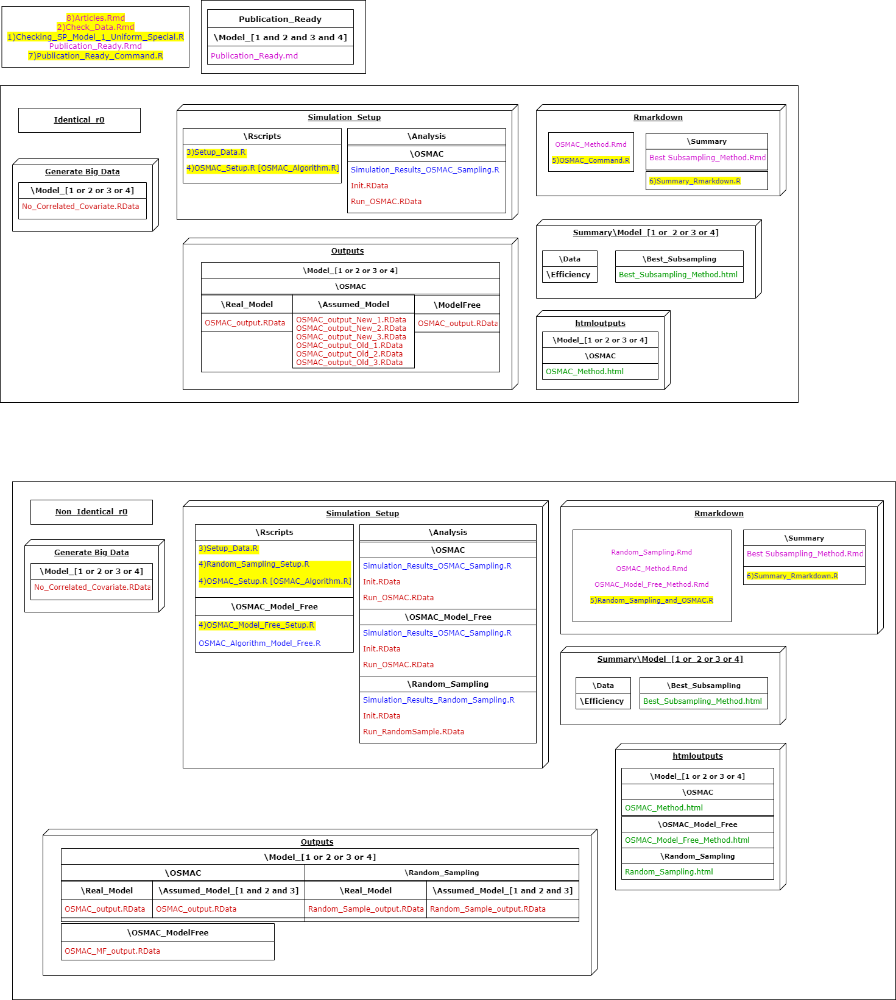

# RS_OS_MROS_PR_TwoVar_Uniform

<!-- badges: start -->
<!-- badges: end -->

### Random Sampling vs Optimal Sub-sampling vs Model Robust Optimal Sub-sampling method for the Poisson Regression with two variables where the covariate data is simulated from the Uniform distribution.

A new model free method is compared with the existing OSMAC method under the circumstances where the initial sample size is same or otherwise for each simulation. 

To be brief, we simulate data from the real model and fit the data with the real model, assumed model and the model free method, and observe if the MSE of the model free method lies between the real and assumed model.

This setup is considered for the Poisson Regression over 1000 simulations for the two covariate scenario, where the models considered are main effect and main effect with squared component.

## Brief summary of how to run the simulation

1. Checking_SP_Model_1_Uniform_Special.R
2. Check_Data.Rmd
3. Setup_Data.R
4. OSMAC_Setup.R [Identical_r0]; Random_Sampling.R, RE_Random_Sampling_Setup.R, OSMAC_Setup.R and OSMAC_Model_Free_Setup.R [Non_Identical_r0]
5. OSMAC_Command.R [Identical_r0]; RE_and_Random_Sampling_and_OSMAC.R [Non_Identical_r0]
6. Summary_Rmarkdown.R
7. Publication_Ready_Command.R
8. Articles.Rmd

For a complete understanding of the Rproject setup refer Manual.md or Manual.html

